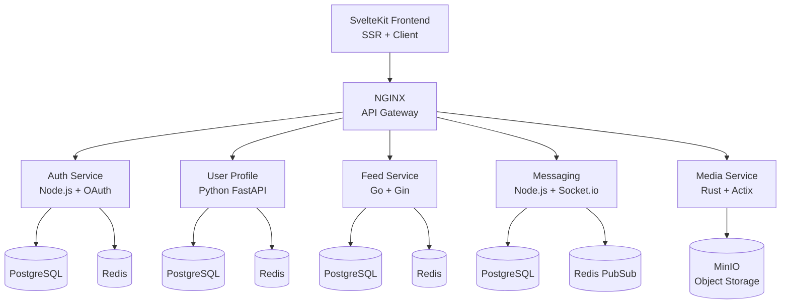

# 🌐 Social Media Platform - Distributed Tracing Example

A comprehensive microservices-based social media platform demonstrating distributed tracing, caching strategies, real-time messaging, and OAuth authentication. Built with multiple languages and frameworks to showcase cross-service trace propagation.

## 🏗️ Architecture Overview



## 🚀 Quick Start

### Prerequisites
- Docker & Docker Compose
- The main telemetry stack running (from project root)
- OAuth app credentials (optional, for full OAuth flow)

### 1. Start the Telemetry Stack
```bash
# From project root
./scripts/setup/start-telemetry-stack.sh
```

### 2. Configure Environment
```bash
# From this directory
cp .env.example .env
# Edit .env with your OAuth credentials (optional)
```

### 3. Build and Start Services
```bash
# Build all services
docker-compose build

# Start the platform
docker-compose up -d

# Check service health
docker-compose ps
```

### 4. Access the Application
- **Frontend**: http://localhost:3000
- **API Gateway**: http://localhost:8080
- **MinIO Console**: http://localhost:9001 (minioadmin/minioadmin)
- **Jaeger UI**: http://localhost:16686 (from main stack)
- **Grafana**: http://localhost:3000 (from main stack)

### 5. Generate Traffic
```bash
# Run mobile simulator
docker-compose run mobile-simulator python simulator.py

# Or run specific scenarios
./scripts/trace-scenarios/user-journey.sh
```

## 📊 Key Distributed Tracing Scenarios

### 1. User Registration & OAuth Flow
- Browser → SvelteKit Server → Auth Service → OAuth Provider
- Profile creation across services
- Session storage in Redis

### 2. Timeline Generation with Caching
- SSR page load with cache checks
- Parallel service calls for user data
- Redis cache hit/miss visualization

### 3. Real-time Messaging
- WebSocket connection tracing
- Message broadcast via Redis PubSub
- Cross-user message delivery

### 4. Media Upload & Processing
- Multipart upload handling
- Async thumbnail generation
- CDN-like caching behavior

## 🔧 Service Details

### Frontend (SvelteKit)
- **Port**: 3000
- **Features**: SSR, OAuth flow, real-time updates
- **Telemetry**: Browser RUM + Server-side tracing

### Auth Service (Node.js)
- **Port**: 3001
- **Features**: JWT auth, OAuth providers, rate limiting
- **Storage**: PostgreSQL + Redis sessions

### User Profile Service (Python)
- **Port**: 3002  
- **Features**: Profile CRUD, follow system, search
- **Caching**: Redis with 1-hour TTL

### Feed Service (Go)
- **Port**: 3003
- **Features**: Timeline generation, post management
- **Caching**: Redis with 5-minute TTL

### Messaging Service (Node.js)
- **Port**: 3004
- **Features**: WebSocket, real-time delivery
- **PubSub**: Redis for message broadcasting

### Media Service (Rust)
- **Port**: 3005
- **Features**: Image processing, storage management
- **Storage**: MinIO S3-compatible

## 📈 Telemetry Features

### Distributed Traces
- W3C Trace Context propagation
- Service dependency visualization
- Error trace correlation
- Performance bottleneck identification

### Metrics
- RED method (Rate, Errors, Duration) per service
- Cache hit/miss ratios
- WebSocket connection metrics
- Business metrics (posts, messages, follows)

### Logs
- Structured JSON logging
- Trace/Span ID correlation
- User context propagation
- Error aggregation

## 🧪 Testing Scenarios

### Load Testing
```bash
# Generate realistic user traffic
./scripts/load-test.sh --users 100 --duration 5m
```

### Trace Verification
```bash
# Verify trace completeness
python scripts/verify-traces.py
```

### Demo User Journeys
```bash
# New user registration and first post
./scripts/trace-scenarios/new-user-journey.sh

# Active user with messaging
./scripts/trace-scenarios/active-user.sh

# High-volume influencer
./scripts/trace-scenarios/influencer.sh
```

## 🔍 Debugging with Jaeger

1. **Find Slow Operations**:
   - Open Jaeger UI: http://localhost:16686
   - Search for traces > 1s duration
   - Analyze service breakdown

2. **Track Errors**:
   - Filter by `error=true`
   - Follow error propagation
   - Check span logs and tags

3. **Service Dependencies**:
   - View System Architecture tab
   - Identify service bottlenecks
   - Monitor call rates

## 📊 Grafana Dashboards

Available dashboards:
- **Service Overview**: RED metrics for all services
- **Cache Performance**: Hit rates and latencies
- **WebSocket Metrics**: Connection counts and message rates
- **Business Metrics**: User activity and content creation

## 🛠️ Development

### Adding a New Service
1. Create service directory
2. Implement OpenTelemetry instrumentation
3. Add to docker-compose.yml
4. Update NGINX configuration
5. Document trace patterns

### Modifying Trace Attributes
- Follow OpenTelemetry semantic conventions
- Add service-specific attributes
- Update documentation

## 📚 Documentation

- [Architecture Guide](docs/architecture.md)
- [Trace Analysis Patterns](docs/trace-patterns.md)
- [Debugging Guide](docs/debugging-guide.md)
- [API Reference](docs/api-reference.md)

## 🐛 Troubleshooting

### Services Not Starting
```bash
# Check logs
docker-compose logs -f <service-name>

# Verify network connectivity
docker network ls
docker network inspect social-media_social-media-net
```

### No Traces Appearing
```bash
# Verify OTEL collector is running
curl http://localhost:13133/

# Check service telemetry config
docker-compose exec <service-name> env | grep OTEL
```

### Database Connection Issues
```bash
# Check database is ready
docker-compose exec <db-name> pg_isready

# Run migrations manually
docker-compose exec <service-name> npm run migrate
```

## 🎯 Learning Objectives

After exploring this example, you'll understand:
- How to propagate trace context across services
- Implementing cache-aware tracing
- WebSocket and real-time communication tracing
- OAuth flow observability
- Performance optimization using distributed traces

## 📝 Notes

- This example uses separate Redis instances for clarity; in production, you might use a single cluster
- MinIO is used instead of real S3 for local development
- OAuth requires real credentials; use mock mode for testing without them
