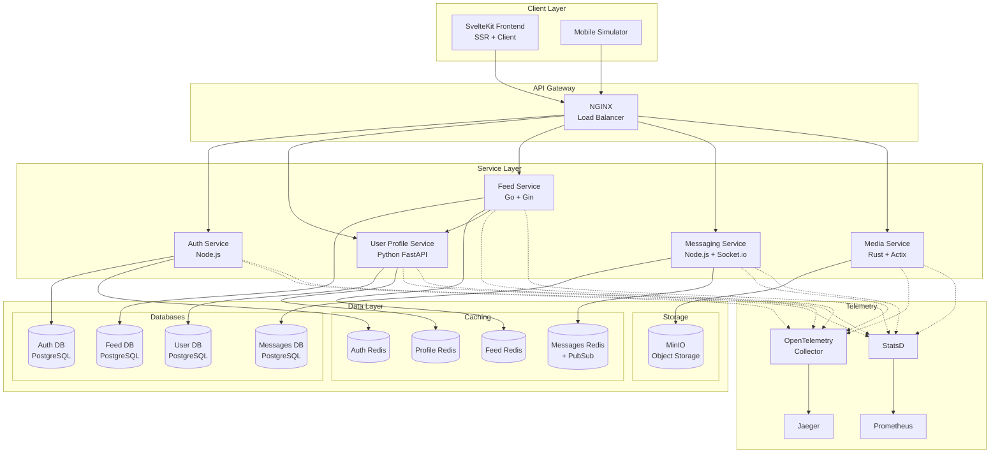

# 🏗️ Social Media Platform Architecture

This document describes the architecture of our distributed social media platform, focusing on how services communicate and how distributed tracing flows through the system.

## System Overview



## Service Responsibilities

### 1. Frontend (SvelteKit)
- **Technology**: SvelteKit with SSR, Skeleton UI
- **Responsibilities**:
  - Server-side rendering for SEO and performance
  - Client-side SPA navigation
  - Real-time WebSocket connections
  - Browser telemetry (RUM)
- **Key Features**:
  - OAuth login flow
  - Timeline rendering
  - Real-time messaging UI
  - Media upload

### 2. Auth Service
- **Technology**: Node.js, Express, Passport.js
- **Database**: PostgreSQL
- **Cache**: Redis (sessions)
- **Responsibilities**:
  - User registration/login
  - OAuth provider integration (Google, GitHub)
  - JWT token generation and validation
  - Session management
  - Rate limiting
- **Key Endpoints**:
  - `POST /api/auth/register`
  - `POST /api/auth/login`
  - `GET /api/auth/google`
  - `POST /api/validate/token`

### 3. User Profile Service
- **Technology**: Python, FastAPI
- **Database**: PostgreSQL
- **Cache**: Redis (profiles, relationships)
- **Responsibilities**:
  - Profile CRUD operations
  - Follow/unfollow relationships
  - User search
  - Profile caching
- **Key Endpoints**:
  - `GET /api/users/{user_id}`
  - `POST /api/users/{user_id}/profile`
  - `POST /api/users/{user_id}/follow`
  - `GET /api/users/search`

### 4. Feed Service
- **Technology**: Go, Gin framework
- **Database**: PostgreSQL
- **Cache**: Redis (timelines, posts)
- **Responsibilities**:
  - Post creation and management
  - Timeline generation
  - Post interactions (likes, comments)
  - Feed caching
- **Key Endpoints**:
  - `POST /api/posts`
  - `GET /api/timeline/{user_id}`
  - `POST /api/posts/{id}/like`

### 5. Messaging Service
- **Technology**: Node.js, Socket.io
- **Database**: PostgreSQL
- **Cache**: Redis PubSub
- **Responsibilities**:
  - Real-time message delivery
  - Message history
  - Online presence
  - Typing indicators
- **Key Features**:
  - WebSocket connections
  - Redis PubSub for scaling
  - Message persistence

### 6. Media Service
- **Technology**: Rust, Actix-web
- **Storage**: MinIO (S3-compatible)
- **Responsibilities**:
  - Image/video upload
  - Media processing (thumbnails)
  - CDN-like serving
  - Storage management

## Data Flow Patterns

### 1. User Registration Flow
```
1. Frontend → Auth Service: Register request
2. Auth Service → PostgreSQL: Store user
3. Auth Service → Redis: Create session
4. Auth Service → Profile Service: Initialize profile
5. Profile Service → PostgreSQL: Store profile
6. Profile Service → Redis: Cache profile
```

### 2. Timeline Generation
```
1. Frontend → Feed Service: Get timeline
2. Feed Service → Redis: Check cache
   - Cache Hit: Return cached timeline
   - Cache Miss: Continue
3. Feed Service → Profile Service: Get following list
4. Feed Service → PostgreSQL: Fetch posts
5. Feed Service → Media Service: Get media URLs
6. Feed Service → Redis: Cache timeline
7. Feed Service → Frontend: Return timeline
```

### 3. Real-time Messaging
```
1. Frontend → WebSocket → Messaging Service
2. Messaging Service → Auth Service: Validate token
3. Messaging Service → PostgreSQL: Store message
4. Messaging Service → Redis PubSub: Broadcast
5. Redis PubSub → Other Messaging instances
6. Messaging Service → Recipients via WebSocket
```

## Caching Strategy

### Cache Layers
1. **Browser Cache**: Static assets, API responses
2. **CDN Cache**: Media files (simulated by Media Service)
3. **Application Cache**: Redis for hot data
4. **Database Cache**: PostgreSQL query cache

### Cache Patterns
- **Cache-Aside**: Read from cache, fallback to DB
- **Write-Through**: Update cache on writes
- **TTL Strategy**:
  - Sessions: 24 hours
  - Profiles: 1 hour
  - Timelines: 5 minutes
  - Posts: 1 hour

### Cache Invalidation
- Profile updates invalidate profile cache
- New posts invalidate follower timelines
- Relationship changes invalidate both user caches

## Security Architecture

### Authentication Flow
```
1. OAuth Provider → Auth Service → JWT Token
2. Frontend stores JWT in httpOnly cookie
3. Every request includes JWT in Authorization header
4. Services validate JWT with Auth Service
```

### Authorization
- Services check user permissions
- Row-level security in databases
- Rate limiting per user/IP

### Data Protection
- Passwords hashed with bcrypt
- JWT tokens signed with RS256
- HTTPS everywhere (in production)
- Input validation at every layer

## Scaling Considerations

### Horizontal Scaling
- All services are stateless
- Redis for shared state
- Database connection pooling
- Load balancing via NGINX

### Performance Optimizations
- Aggressive caching
- Database indexing
- Async processing where possible
- Connection pooling

### Monitoring & Observability
- Distributed tracing with OpenTelemetry
- Metrics with StatsD → Prometheus
- Centralized logging with trace correlation
- Health checks for all services

## Deployment Architecture

### Development (Docker Compose)
- All services in one network
- Shared telemetry network
- Volume mounts for development

### Production Considerations
- Kubernetes deployment
- Service mesh (Istio/Linkerd)
- External databases (RDS, ElastiCache)
- CDN for media delivery
- Auto-scaling based on metrics

## Technology Choices Rationale

### Why Multiple Languages?
- Demonstrates polyglot tracing
- Realistic microservices scenario
- Language strengths:
  - Node.js: Real-time, OAuth
  - Python: Rapid development
  - Go: High performance
  - Rust: Memory safety for media

### Why Multiple Databases?
- Service independence
- Schema isolation
- Independent scaling
- Failure isolation

### Why Redis Everywhere?
- Fast caching layer
- PubSub for real-time
- Session storage
- Rate limiting

## Common Patterns

### Request Authentication
```javascript
// Every service validates tokens
const user = await authService.validateToken(token);
if (!user) throw new UnauthorizedError();
```

### Trace Propagation
```python
# Extract parent trace
parent_ctx = propagator.extract(headers)

# Create child span
with tracer.start_as_current_span("operation", parent_ctx):
    # Service logic
```

### Cache Pattern
```go
// Try cache first
cached, err := redis.Get(key)
if err == nil {
    return cached
}

// Fetch from DB
data := db.Query(...)

// Cache for next time
redis.Set(key, data, ttl)
return data
```

## Performance Targets

- **API Response Time**: < 200ms (p99)
- **Timeline Generation**: < 100ms (cached)
- **Message Delivery**: < 50ms
- **Media Upload**: < 5s for 10MB
- **Cache Hit Ratio**: > 80%
- **Error Rate**: < 0.1%

## Failure Scenarios

### Service Failures
- Auth Service down: No new logins, existing sessions work
- Profile Service down: Degraded experience, cached data served
- Feed Service down: No new posts, cached timelines served
- Redis down: Fallback to database, slower performance

### Database Failures
- Connection pooling prevents cascade
- Read replicas for resilience
- Graceful degradation

### Network Partitions
- Circuit breakers prevent cascading failures
- Timeouts on all external calls
- Retry with exponential backoff

This architecture provides a robust, scalable platform with comprehensive observability through distributed tracing, metrics, and logging.
