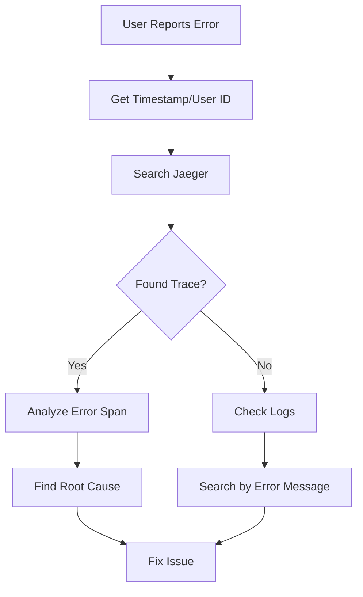
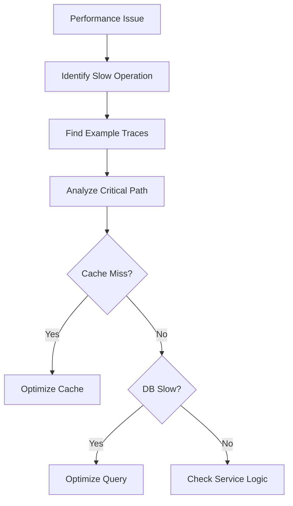

# 🐛 Debugging Guide for Distributed Systems

This guide helps you debug issues in the social media platform using distributed tracing, logs, and metrics.

## Quick Debugging Checklist

When something goes wrong:
1. ✅ Check service health endpoints
2. ✅ Look for error traces in Jaeger
3. ✅ Check logs with trace correlation
4. ✅ Verify metrics in Grafana
5. ✅ Test service dependencies

## Common Issues and Solutions

### 1. Service Won't Start

**Symptoms:**
- Container exits immediately
- Health check failures
- Connection refused errors

**Debugging Steps:**
```bash
# Check container logs
docker-compose logs auth-service

# Verify environment variables
docker-compose exec auth-service env

# Test database connection
docker-compose exec auth-db pg_isready

# Check port availability
lsof -i :3001
```

**Common Causes:**
- Missing environment variables
- Database not ready
- Port already in use
- Missing dependencies

### 2. No Traces in Jaeger

**Symptoms:**
- Services running but no traces appear
- Partial traces only

**Debugging Steps:**
```bash
# Verify OTEL collector is running
curl http://localhost:13133/

# Check service telemetry config
docker-compose exec auth-service env | grep OTEL

# Test trace export manually
curl -X POST http://localhost:4318/v1/traces \
  -H 'Content-Type: application/json' \
  -d '{"resourceSpans":[]}'
```

**Solutions:**
- Ensure `OTEL_EXPORTER_OTLP_ENDPOINT` is correct
- Check network connectivity between services
- Verify telemetry initialization in code

### 3. Authentication Failures

**Symptoms:**
- 401 Unauthorized errors
- Token validation failures
- OAuth callback errors

**Trace Analysis:**
```
1. Search Jaeger for: service="auth-service" error=true
2. Check span attributes for error details
3. Look for "auth.valid=false" tags
```

**Common Issues:**
- Expired JWT tokens
- Redis session timeout
- Invalid OAuth credentials
- Clock skew between services

### 4. Slow API Responses

**Symptoms:**
- Timeouts
- High latency
- User complaints

**Performance Debugging:**
```bash
# Find slow traces
# In Jaeger: Min Duration = 1s

# Check cache performance
# Look for: cache.hit=false

# Database query analysis
# Search for: db.operation tags
```

**Optimization Points:**
- Missing database indexes
- N+1 query problems
- Sequential operations that could be parallel
- Cache misses

### 5. Service Communication Errors

**Symptoms:**
- 503 Service Unavailable
- Connection timeouts
- Incomplete traces

**Network Debugging:**
```bash
# Test service connectivity
docker-compose exec auth-service curl http://user-profile-service:8000/health

# Check DNS resolution
docker-compose exec auth-service nslookup user-profile-service

# Verify service discovery
docker network inspect social-media_social-media-net
```

## Using Logs with Traces

### Correlating Logs and Traces

All services output structured JSON logs with trace context:

```json
{
  "timestamp": "2024-01-15T10:30:00.123Z",
  "level": "ERROR",
  "service": "auth-service",
  "trace_id": "5c9e7c8b3d4f2a1b",
  "span_id": "7a8b9c0d1e2f3a4b",
  "message": "OAuth callback failed",
  "error": "Invalid state parameter"
}
```

**Finding Related Logs:**
```bash
# Get logs for specific trace
docker-compose logs --no-log-prefix auth-service | \
  grep "5c9e7c8b3d4f2a1b"

# Stream logs with trace ID
docker-compose logs -f | grep "trace_id"
```

### Log Aggregation Patterns

```bash
# Error summary across services
docker-compose logs | jq -r 'select(.level=="ERROR") | 
  "\(.service): \(.message)"' | sort | uniq -c

# Request count by endpoint
docker-compose logs auth-service | \
  jq -r 'select(.endpoint) | .endpoint' | \
  sort | uniq -c | sort -rn
```

## Metrics-Based Debugging

### Key Metrics to Monitor

1. **RED Metrics**
   - **Rate**: Requests per second
   - **Errors**: Error rate by endpoint
   - **Duration**: Request latency

2. **Cache Metrics**
   - Hit/miss ratio
   - Eviction rate
   - Memory usage

3. **Database Metrics**
   - Query duration
   - Connection pool usage
   - Lock contention

### Grafana Queries

```promql
# Service error rate
rate(auth_service_errors[5m]) / rate(auth_service_requests[5m])

# Cache hit ratio
sum(rate(user_profile_service_cache_hit[5m])) /
sum(rate(user_profile_service_cache_operations[5m]))

# P99 latency
histogram_quantile(0.99, 
  rate(feed_service_request_duration_bucket[5m]))
```

## Distributed Debugging Workflows

### 1. Debugging a Failed Request



### 2. Performance Investigation



## Service-Specific Debugging

### Auth Service
```bash
# Check OAuth state issues
docker-compose exec auth-redis redis-cli
> KEYS oauth:state:*

# Verify JWT secrets
docker-compose exec auth-service node -e \
  "console.log(process.env.JWT_SECRET)"

# Test token validation
curl -X POST http://localhost:8080/api/validate/token \
  -H "Content-Type: application/json" \
  -d '{"token":"<your-token>"}'
```

### User Profile Service
```python
# Debug cache issues
docker-compose exec user-profile-service python
>>> import redis
>>> r = redis.from_url("redis://profile-redis:6379")
>>> r.keys("profile:*")

# Check database queries
# Enable SQL logging: echo=True in database.py
```

### Feed Service
```go
// Add debug logging
log.Printf("Cache lookup for key: %s", key)
log.Printf("Database query: %s", query)

// Enable pprof for profiling
import _ "net/http/pprof"
go http.ListenAndServe(":6060", nil)
```

## Advanced Debugging Techniques

### 1. Distributed Tracing Patterns

**Trace Sampling Issues:**
```yaml
# Force sampling for debugging
environment:
  - OTEL_TRACES_SAMPLER=always_on
  - OTEL_TRACES_SAMPLER_ARG=1.0
```

**Custom Span Attributes:**
```javascript
span.setAttributes({
  "debug.user_id": userId,
  "debug.request_size": requestSize,
  "debug.cache_key": cacheKey
});
```

### 2. Chaos Engineering

```bash
# Inject latency
docker-compose exec auth-service \
  tc qdisc add dev eth0 root netem delay 200ms

# Simulate service failure
docker-compose stop user-profile-service

# Test circuit breaker
while true; do
  curl http://localhost:8080/api/users/123
  sleep 1
done
```

### 3. Load Testing for Debugging

```bash
# Generate load to reproduce issues
ab -n 1000 -c 10 \
  -H "Authorization: Bearer $TOKEN" \
  http://localhost:8080/api/timeline/user123

# Monitor during load
watch -n 1 'docker stats --no-stream'
```

## Debugging Tools

### 1. Container Debugging
```bash
# Enter container for debugging
docker-compose exec auth-service sh

# Install debugging tools
apk add --no-cache curl jq tcpdump

# Capture network traffic
tcpdump -i any -w trace.pcap host user-profile-service
```

### 2. Database Debugging
```sql
-- Check slow queries
SELECT query, calls, mean_exec_time
FROM pg_stat_statements
ORDER BY mean_exec_time DESC
LIMIT 10;

-- Active connections
SELECT pid, usename, application_name, state
FROM pg_stat_activity;

-- Lock monitoring
SELECT * FROM pg_locks WHERE NOT granted;
```

### 3. Redis Debugging
```bash
# Monitor Redis commands
docker-compose exec auth-redis redis-cli monitor

# Check memory usage
docker-compose exec auth-redis redis-cli info memory

# Slow log
docker-compose exec auth-redis redis-cli slowlog get 10
```

## Emergency Procedures

### Service Recovery
1. **Restart failed service**: `docker-compose restart <service>`
2. **Clear cache**: Connect to Redis and `FLUSHDB`
3. **Reset database**: Run migrations again
4. **Restore from backup**: If data corruption

### Performance Emergency
1. **Increase resources**: Scale service replicas
2. **Disable non-critical features**: Feature flags
3. **Enable emergency cache**: Longer TTLs
4. **Shed load**: Rate limiting

## Prevention Best Practices

1. **Add comprehensive logging** at decision points
2. **Include trace context** in all logs
3. **Set up alerts** for error rates
4. **Regular load testing** to find limits
5. **Chaos engineering** to test resilience
6. **Documentation** of known issues

This guide helps you quickly identify and resolve issues in your distributed system using the observability tools at your disposal.
