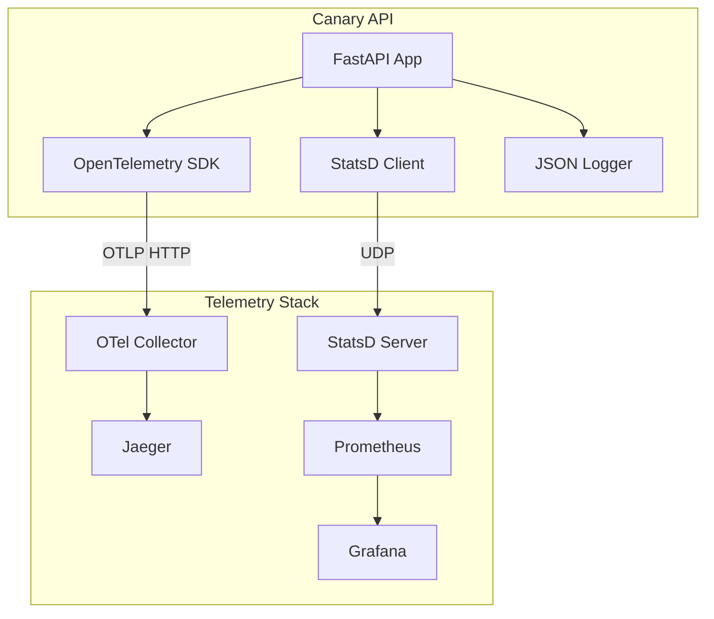

# 🐦 Canary API - Python FastAPI with Full Observability

A production-ready example of a FastAPI application with complete observability integration, demonstrating OpenTelemetry tracing, StatsD metrics, and structured JSON logging.

## 🚀 Quick Start

### Prerequisites
- Docker and Docker Compose installed
- The main telemetry stack running (see [main README](../../README.md))
- Port 8000 available

### 1. Start the Telemetry Stack
```bash
# From the project root
cd ../..
./scripts/setup/start-telemetry-stack.sh
```

### 2. Start the Canary API
```bash
# From this directory
docker-compose up --build
```

### 3. Test the API
```bash
# In another terminal
python test_telemetry.py
```

### 4. View Telemetry Data
- **Traces**: http://localhost:16686 (search for "canary-api")
- **Metrics**: http://localhost:9090 (query "canary_api")
- **Dashboards**: http://localhost:3000 (admin/admin)

## 📋 API Endpoints

### GET /chirp
Health check endpoint that returns service status.

```bash
curl http://localhost:8000/chirp
```

Response:
```json
{
  "status": "alive",
  "timestamp": "2024-01-15T10:30:00.123Z",
  "service_name": "canary-api",
  "service_version": "1.0.0"
}
```

### POST /nest
Create a new nest resource.

```bash
curl -X POST http://localhost:8000/nest \
  -H "Content-Type: application/json" \
  -d '{
    "name": "Cozy Nest",
    "type": "deluxe",
    "material": "premium twigs"
  }'
```

Response:
```json
{
  "id": "nest_1705315800123_0",
  "name": "Cozy Nest",
  "type": "deluxe",
  "material": "premium twigs",
  "created_at": "2024-01-15T10:30:00.123Z"
}
```

### GET /flock
List nest resources with pagination.

```bash
curl "http://localhost:8000/flock?limit=10&offset=0"
```

Response:
```json
[
  {
    "id": "nest_1705315800123_0",
    "name": "Cozy Nest",
    "type": "deluxe",
    "material": "premium twigs",
    "created_at": "2024-01-15T10:30:00.123Z"
  }
]
```

## 🏗️ Architecture



## 📊 Telemetry Features

### 1. Distributed Tracing
- Automatic HTTP instrumentation via OpenTelemetry
- Custom spans for business logic
- Trace context propagation
- Error tracking with stack traces

### 2. Metrics Collection
- Request counters by endpoint and method
- Request duration histograms
- Custom business metrics (nest count, creation rate)
- Real-time StatsD metrics

### 3. Structured Logging
- JSON formatted logs
- Trace ID correlation
- Log levels (DEBUG, INFO, WARNING, ERROR)
- Contextual metadata

## 🔧 Configuration

### Environment Variables

| Variable | Description | Default |
|----------|-------------|---------|
| `SERVICE_NAME` | Service identifier | `canary-api` |
| `SERVICE_VERSION` | Service version | `1.0.0` |
| `OTLP_ENDPOINT` | OpenTelemetry collector endpoint | `http://localhost:4318/v1/traces` |
| `STATSD_HOST` | StatsD server host | `localhost` |
| `STATSD_PORT` | StatsD server port | `8125` |
| `LOG_LEVEL` | Logging level | `INFO` |
| `RELOAD` | Enable hot reload (dev only) | `false` |

### Custom Configuration

1. Copy `.env.example` to `.env`
2. Modify values as needed
3. Restart the service

## 📈 Metrics Reference

### Counter Metrics
- `canary_api_requests_total` - Total requests by endpoint and method
- `canary_api_nests_created_total` - Total nests created by type
- `canary_api_errors_total` - Total errors by endpoint

### Gauge Metrics
- `canary_api_nest_count` - Current number of nests
- `canary_api_flock_query_size` - Size of flock query results

### Histogram Metrics
- `canary_api_request_duration` - Request duration in milliseconds

## 🔍 Troubleshooting

### Service Won't Start

1. Check if telemetry stack is running:
   ```bash
   docker ps | grep telemetry-nest
   ```

2. Verify network exists:
   ```bash
   docker network ls | grep telemetry-nest
   ```

3. Check container logs:
   ```bash
   docker-compose logs canary-api
   ```

### No Traces in Jaeger

1. Verify OTLP endpoint is accessible:
   ```bash
   curl http://localhost:4318/v1/traces
   ```

2. Check collector logs:
   ```bash
   docker logs telemetry-nest-otel-collector
   ```

3. Ensure service name is correct in Jaeger UI

### No Metrics in Prometheus

1. Check StatsD connectivity:
   ```bash
   echo "test.metric:1|c" | nc -u -w0 localhost 8125
   ```

2. Verify Prometheus targets:
   - Go to http://localhost:9090/targets
   - Check if StatsD exporter is UP

3. Query raw metrics:
   ```
   curl http://localhost:9102/metrics | grep canary
   ```

### Missing Logs

1. Check container output:
   ```bash
   docker-compose logs -f canary-api
   ```

2. Verify JSON formatting:
   ```bash
   docker-compose logs canary-api 2>&1 | tail -n 10 | jq .
   ```

## 🧪 Testing

### Unit Tests
```bash
# Install dev dependencies
pip install -r requirements.txt

# Run tests
pytest
```

### Integration Tests
```bash
# Run the telemetry verification script
python test_telemetry.py
```

### Load Testing
```bash
# Simple load test
for i in {1..100}; do
  curl -s http://localhost:8000/chirp &
done
wait
```

## 📚 Code Structure

```
examples/python-fastapi/
├── app.py                 # Main FastAPI application
├── requirements.txt       # Python dependencies
├── Dockerfile            # Multi-stage Docker build
├── docker-compose.yml    # Service orchestration
├── test_telemetry.py     # Verification script
├── .env.example          # Environment template
├── .dockerignore         # Docker ignore rules
└── README.md            # This file
```

## 🎯 Key Patterns for AI Agents

### Adding a New Endpoint

1. Define Pydantic models for request/response
2. Create endpoint with automatic instrumentation
3. Add custom span for business logic
4. Record relevant metrics
5. Include structured logging

Example:
```python
@app.post("/new-endpoint")
async def new_endpoint(data: NewModel):
    with tracer.start_as_current_span("new_endpoint_handler"):
        statsd_client.incr('requests', tags=['endpoint:new', 'method:POST'])
        logger.info("Processing new endpoint", extra={"extra_fields": {"data": data.dict()}})
        # Your business logic here
        return {"status": "success"}
```

### Adding Custom Metrics

```python
# Counter
statsd_client.incr('custom_event', tags=['type:important'])

# Gauge
statsd_client.gauge('queue_size', len(queue))

# Timing
with statsd_client.timer('processing_time'):
    process_data()
```

### Trace Context Propagation

```python
# Get current trace context
span = trace.get_current_span()
trace_id = format(span.get_span_context().trace_id, '032x')

# Pass to external service
headers = {'X-Trace-Id': trace_id}
```

## 🚦 Production Considerations

1. **Security**: Use environment-specific secrets management
2. **Performance**: Adjust batch sizes and flush intervals
3. **Sampling**: Implement trace sampling for high-volume services
4. **Storage**: Configure appropriate retention policies
5. **Alerting**: Set up alerts based on metrics thresholds

## 📝 License

This example is part of the Agent Observability Verifier project. See the main [LICENSE](../../LICENSE) file.

---

**Built with 🐦 by the Telemetry Nest Team**
